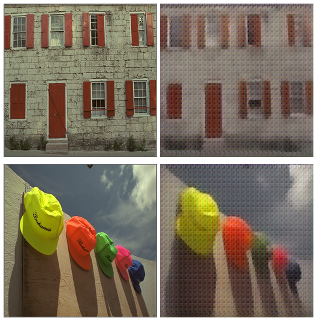
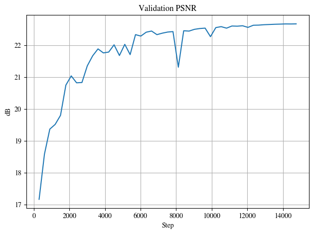

Implementation of Deeplearning-based image coding scheme from the works of: "Scalable Image Coding for Humans and Machines" by Hyomin Choi, Ivan V. Bajic at [here](https://arxiv.org/abs/2107.08373) with the references from:
+ "End-to-end Optimized Image Compression" by Johannes Ballé, Valero Laparra, Eero P. Simoncelli at [here](https://arxiv.org/abs/1611.01704)
+ "Variational image compression with a scale hyperprior" by Johannes Ballé, David Minnen, Saurabh Singh, Sung Jin Hwang, Nick Johnston at [here](https://arxiv.org/abs/1802.01436)
+ "Joint Autoregressive and Hierarchical Priors for Learned Image Compression" by David Minnen, Johannes Ballé, George Toderici at [here](https://arxiv.org/abs/1809.02736)
+ "Learned Image Compression with Discretized Gaussian Mixture Likelihoods and Attention Modules" by Zhengxue Cheng, Heming Sun, Masaru Takeuchi, Jiro Katto at [here](https://arxiv.org/abs/2001.01568)

This work in this repo was trained on CLIC 2020 dataset (686 images), DIV2K dataset(900 images) and VIMEO90K dataset (165,285 images) for 30 epochs.

